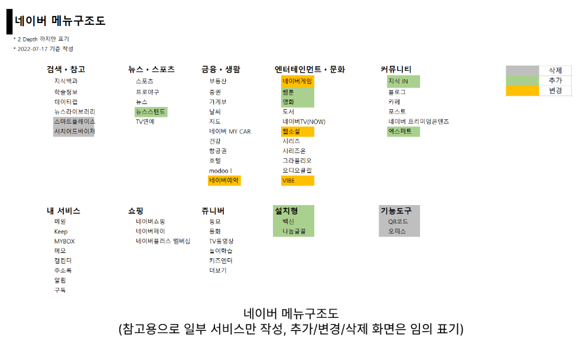
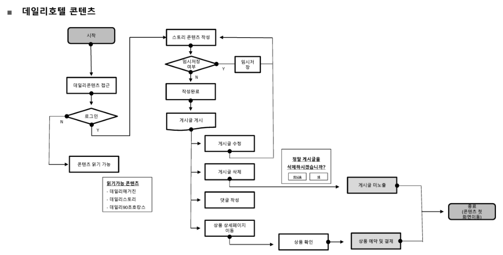
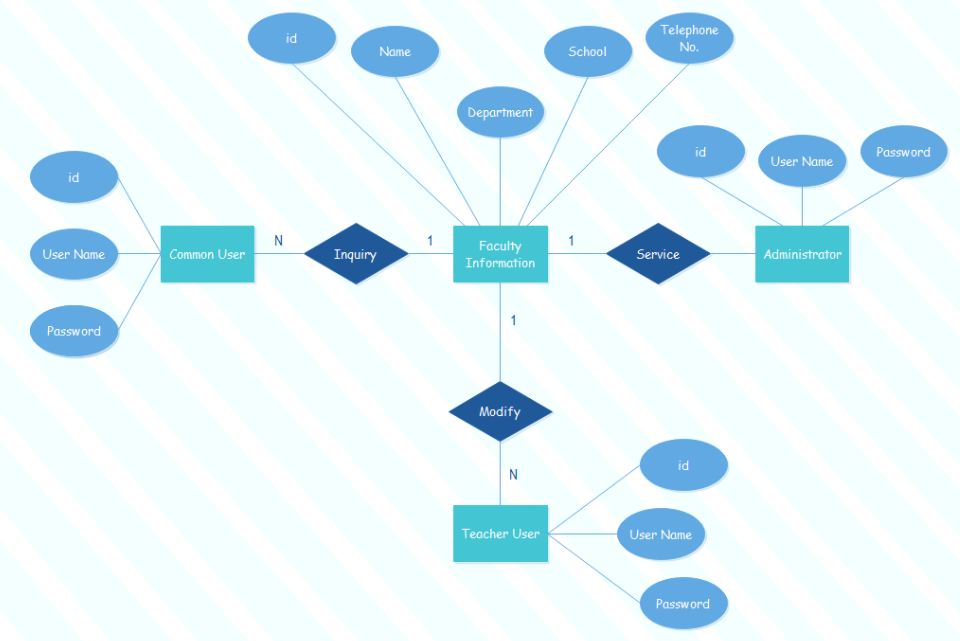
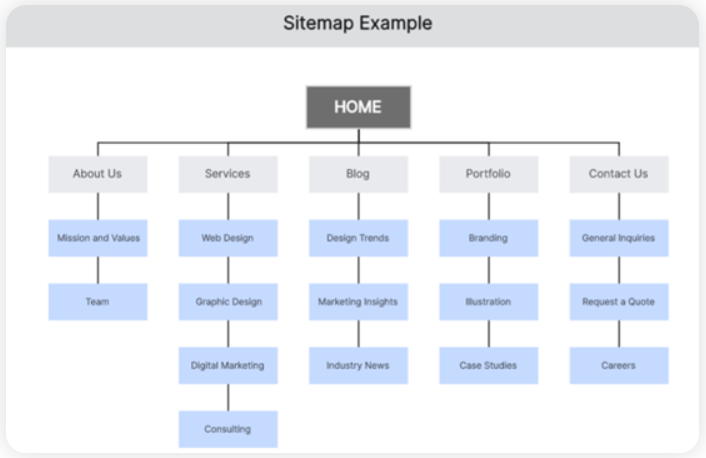
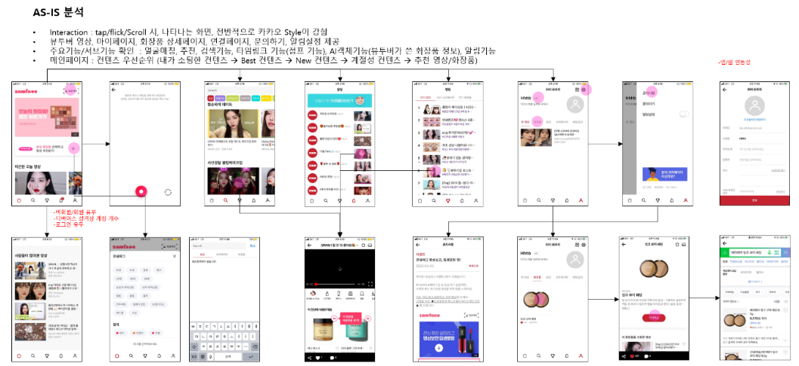
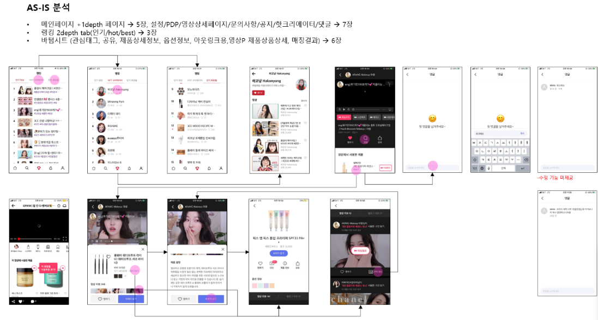

# 웹 사이트 문서화

# 웹 사이트 문서화의 중요성

- 웹 사이트는 혼자 만드는 것이 아니라 프로그래머, 디자이너의 협력에 의해 만들어지며 기획자와의 상호 면밀한 커뮤니케이션을 통해 기획 내용이 전달되어야 정확한 기획 의도가 반영된 웹 사이트를 제작할 수 있음

## 1. 웹 사이트 의뢰자와의 정확한 커뮤니케이션과 인증

- 기획자와 요청자 사이에 어떤 사이트를 제작할 것인지에 대한 합의가 이루어지지만 웹 사이트의 특성상 몇몇 단어로 모든 부분에 대한 명확한 사이트 표현이 불가능
- 명확한 웹 사이트의 기획 문서를 통한 합의 및 인증이 이루어지지 않는 경우, 웹 사이트가 제작된 이후에 많은 논쟁거리가 발생할 가능성이 높음
- 이런 논쟁을 사전에 예방하기 위해서는 웹 사이트 제작에 대한 의뢰자와의 명확한 커뮤니케이션과 앞으로 만들어질 사이트의 컨셉, 기능, 업무의 범위 등을 확정짓는 문서화가 필요함

## 2. 웹 사이트 제작 개발자와의 커뮤니케이션

- 사이트의 규모가 커지거나 투입되는 인력이 많아지면 모든 내용을 구두로 다 설명할 수 없음
- 구두로 설명할 경우,
    - 각 작업자가 전체를 보지 못하고 작업을 하게 됨으로써 작업의 지연과 다른 방향으로의 작업, 중복이나 반복 작업을 하게 될 가능성이 높아짐
    - 이런 일들이 자주 일어나면 작업 능률도 떨어짐
    - 전체적인 비용 증가와 프로젝트 기간의 지연으로 나타나게 됨
- 따라서 웹 사이트를 정확하게 표현할 수 있는 웹 사이트의 문서화가 필요함

## 3. 웹 사이트의 기록

- 웹 사이트가 초기에 기획될 때의 설계 문서를 보관한다면 웹 사이트의 운영 방향을 설정하거나 추후 웹 사이트에 새로운 부분을 추가하거나 업데이트할 때 유용한 문서로 활용할 수 있음
- 웹 사이트를 개발한 사람이 해당 웹 사이트의 수명이 다할 때까지 모든 업무를 맡아서 하는 경우는 많지 않기 때문
- 다른 비슷한 웹 사이트를 제작할 때의 참고 문서로도 활용하여 시행착오를 줄일 수 있는 노하우로 작용할 것

# 웹 사이트 문서화의 어려움

- 웹 사이트는 텍스트 문서, 그림 및 이미지, 프로그램 기능, 움직이는 영상, 게임 등 거의 모든 멀티미디어의 구현이 가능
- 각 페이지들도 링크라는 방식을 통해 연결되어 움직이므로, 2차원적인 텍스트 문서로 완성될 사이트의 모든 것을 미리 보여준다는 것은 어쩌면 불가능할지도 모름
- 웹 사이트의 기획 문서를 가지고, 여러 팀이 각자 사이트를 만든다고 했을 때 똑같은 사이트가 나오는 경우는 없을 것
- 많은 웹 기획자들이 웹 사이트를 만들기 전에 미리 만든 후의 사이트를 표현할 수 있는 문서 형식에 대한 다각도의 연구와 고민을 함과 동시에, 사이트 제작의 전 과정에 거쳐 자신의 기획 의도대로 사이트가 제작되는지에 대한 관리를 하는 기법들을 연구하고 실천하는 방향으로 접근해 가고 있음

# 웹 사이트 기획 문서의 종류

- 각각의 문서는 다양한 표현이 가능한 웹 사이트를 표현하기 위해서 각 분야에서 웹 사이트에 접목하여 만들어진 문서
- 웹 사이트의 특성에 따라 각각의 문서들을 복합적으로 사용하여 웹 사이트를 기획하고 문서화하게 됨

## 1. 사이트 메뉴 구조도

- 웹 사이트 전체 구조를 메뉴를 통해 한눈에 파악할 수 있도록 하고, 어떤 콘텐츠가 들어가는지를 보여주는 문서
- 일반적으로 웹 사이트에 ‘사이트맵’이라는 메뉴를 통해 사이트 메뉴 구조도를 이용자들에게 내비게이션의 한 형태로 보여주고 있음

## 2. 플로우 차트

- 사이트에 전체 또는 특정 부분의 논리의 흐름을 순서도 형식을 빌려 표현하는 문서
- 주로 프로그램 설계에 많이 사용되던 문서로, 프로그램적인 기능을 표현할 때 사용함

## 3. ERD(Entity Relationship Diagram)

- 주로 데이터베이스의 테이블 간에 연결관계가 복잡하거나, 데이터베이스를 많이 사용하는 웹 사이트에서 데이터베이스 설계를 할 때 사용하는 문서로 테이블 간의 연결관계를 표현하는 문서

## 4. 스타일 가이드

- 디자인의 컨셉을 표현하는 문서
- 제작될 웹 사이트의 디자인이 어떤 색감, 어떤 폰트, 어떤 디자인 구성, 어떤 컨셉으로 디자인될 것인지를 보여주는 문서

## 5. 사이트맵(사이트 설계도)

- 웹 사이트가 제작되면서 작성되는 모든 파일을 기준으로 전체 사이트 파일 리스트를 구조적으로 작성하고, 각 파일들의 특성을 정리하는 문서
- 사이트의 기능 및 규모를 보여주고, 스토리보드의 목차 역할도 함

## 6. 스토리보드

- 사이트를 제작할 때 가장 많이 사용하는 문서로 각각의 웹 사이트 페이지의 구성을 그린 문서