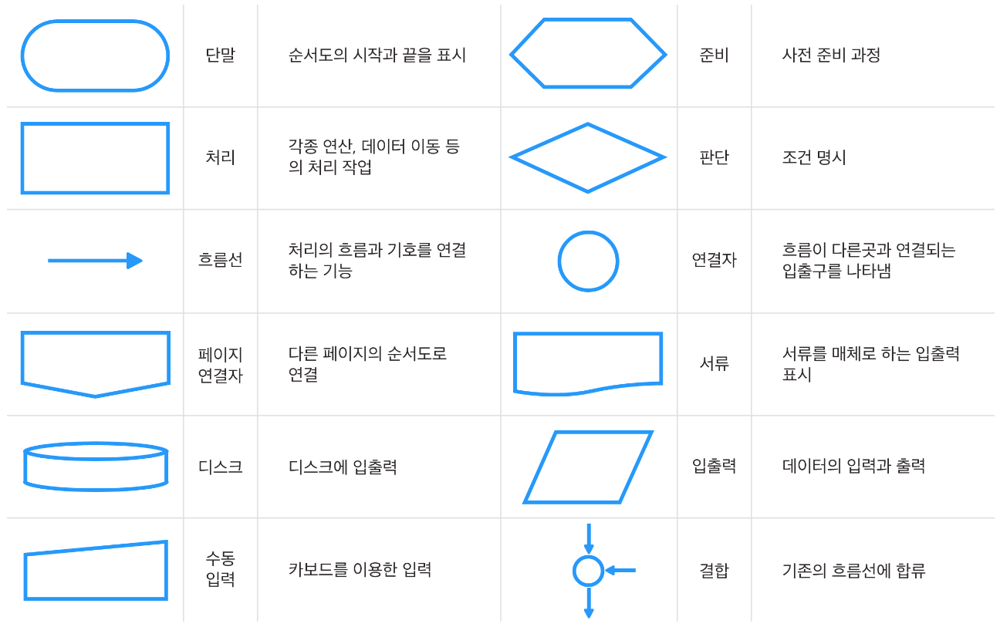
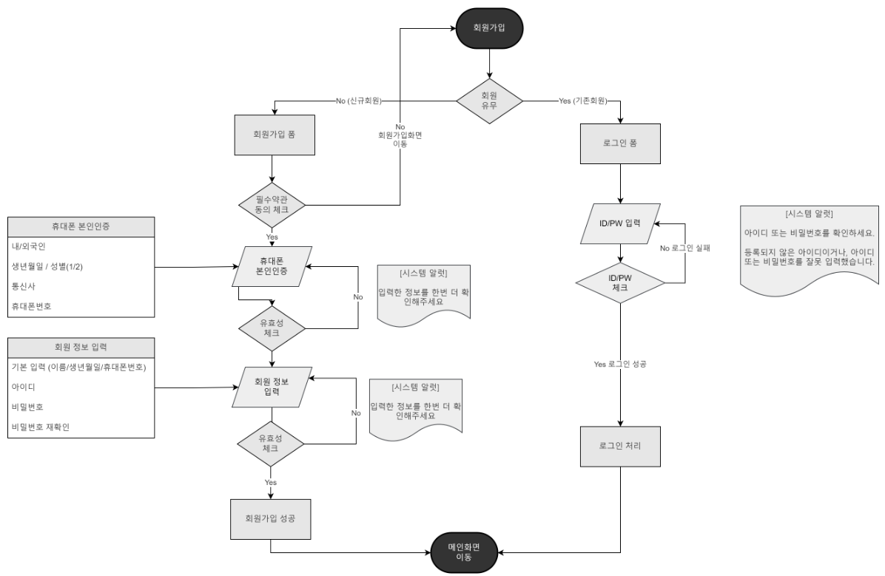

# 플로우차트

# 플로우차트란 무엇인가?

- 플로우차트(Flow Chart): 알고리즘 또는 문제 해결의 절차를 그림으로 알기 쉽게 나타낸 것
- 메뉴를 표현하는 구조도만으로는 사이트의 흐름이나 로직을 표현할 수 없으므로, 플로우차트를 이용하여 표현하면 좀 더 쉽게 이해할 수 있음
- 사이트에서 회원제도를 두는 경우, 모든 회원제도 부분의 기획자 의도가 정확하게 전달되어야 함
    - 회원 가입을 하는 순서
    - 로그인과 로그아웃의 로직
    - 회원 권한에 대한 흐름 이해

## 플로우차트를 그리는 이유

1. 논리적인 기획 의도를 제작진에게 체계적으로 표현할 수 있음
2. 전체적인 업무의 개요를 파악할 수 있음
3. 논리의 정확성을 쉽게 판단할 수 있음
4. 프로그램 기획을 쉽게 할 수 있음
5. 사이트의 유지 보수 및 업데이트시 로직의 이해를 쉽게 함

# 플로우차트를 그리는 방법

## 1. 논리적인 흐름을 표현해야 할 부분이 있는지 확인한다

- 플로우차트는 주로 프로그램적 논리의 흐름을 표현해야 할 때 사용되는 문서이므로, 이런 부분이 있는지를 먼저 확인하는 작업이 필요함
- 하나의 사이트 내에 플로우차트를 그려야할 부분이 하나일 수도 있고, 여러 개일 수도 있음
- 예를 들어 쇼핑몰을 제작한다면
    - 구매 절차 흐름
    - 마일리지 절차 흐름
    - 회원 가입 흐름 등

## 2. 순서도 그리는 방식에 입각하여 흐름을 표현한다

- 프로그램의 논리의 흐름이 정의되었다면 순서도 그리는 방식에 입각하여 흐름을 표현하게 됨
- 로직의 흐름을 그림으로 표현하고 그것을 논리적으로 정의해 놓은 순서도가 여기서 말하는 플로우차트임

## 플로우차트에서 사용하는 기호

- 단말: 순서도의 시작과 끝을 표시(시작점, 끝나는 점, 중단점, 지연점, 환입점 등)
- 입출력: 모든 종류의 입출력 표시, 개략 순서도와 세부 순서도에서 항상 이 기호를 입출력 표시로 사용
- 처리: 모든 처리 과정을 표시, 기호 내에 처리 내용을 기입
- 비교/판단: 조건에 따라 몇 개의 경로로 갈라짐을 표시
- 연결자: 동일 페이지 내에서 순서도가 다른 부분으로 빠져나가거나, 또는 다른 부분에서 들어올 때 기호 내에 숫자나 문자를 사용하여 상호 연결됨을 표시
- 서류: 종이로 출력하는 부분을 원래 의미하였으나, 일반적인 출력을 표시하기도 함
- 주석: 작업 내용 또는 처리 내용 등의 설명을 필요로 하는 곳에 점선으로 연결하여 표시

## 플로우차트 그리기

### 회원 가입 플로우차트

1. 회원 가입 시작
    - 시작 표시 박스 안에 작성하여 플로우차트의 시작점을 의미함
    - 아직 회원이 아닌 사람이 회원 가입을 시작함을 의미
2. 필수 약관 동의 체크
    - 회원 가입 프로세스를 시작하면 이용자는 회원에 대한 약관을 보게 됨
    - 이용자는 자신이 이 약관에 동의를 하여 회원 가입을 계속 진행할 것인지 그렇지 않을 것인지를 선택하게 됨
    - 마름모꼴로 생긴 비교/판단 박스로 표시되어 있으며, 이 마름모꼴 박스로 들어가고 나가는 화살표들은 각 선택에 대한 다른 방향의 프로세스로 향하게 됨
    - 여기서는 약관에 동의한 경우와 그렇지 않은 경우로 나뉠 수 있음
    - 약관에 동의하지 않은 회원은 다시 회원가입 화면으로 이동시키며, 약관에 동의한 회원은 휴대푠 본인인증 페이지로 이동하게 됨
3. 회원 정보 입력
    - 약관에 동의한 회원은 휴대폰 본인인증 후 회원 정보 입력이라는 평행사변형으로 표시된 박스에서 입력을 처리하게 됨
    - 평행사변형 박스는 입력 또는 출력에 사용되며, 회원은 자신의 회원 가입 정보를 입력하게 됨
4. 유효성 체크
    - 입력한 정보의 유효성을 체크하게 되는데, 주석 표시를 통해 어떤 것을 중복 체크할 것인지 표시할 수 있음
    - 유효성의 체크를 통해 정보가 유효한지 또는 그렇지 않은지를 판단하여 각각 다른 프로세스로 보내주는 비교/판단 부분을 처리하는 박스로 되어 있음
    - 데이터가 유효한 경우에는 회원가입 성공 처리 박스로 이동하며, 그렇지 않은 경우에는 다시 회원 정보 입력 박스로 이동하게 됨
5. 회원가입 완료
    - 정상적으로 회원가입이 처리된 경우 메이페이지로 이동시킴