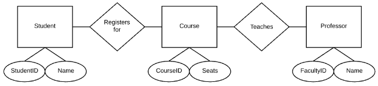
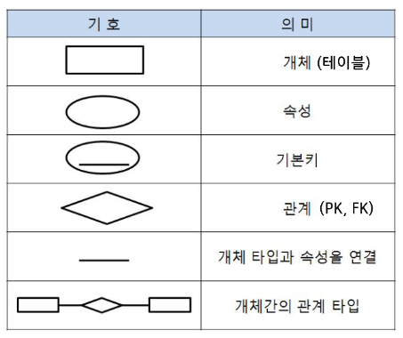

# 데이터베이스 구조 설계도(ERD)

# 데이터베이스 설계의 중요성

- 데이터베이스의 구조 설계는 일반적으로 프로그래머가 하지만, 기획자는 웹 사이트 제작의 모든 부분을 끌고 나가는 사람이기 때문에 개념 이해가 바탕이 되어야 전체 웹 사이트 개발 프로젝트를 원활히 진행해 나갈 수 있을 것
- 데이터베이스는 초기에 어떻게 설계되어 제작되었는지에 따라서 추후에 많은 문제를 일으키기도 하고 그렇지 않기도 함
- 잘못 설계된 데이터베이스는 초기에는 잘 운영되는 것처럼 보이지만, 시간이 지날수록 치명적인 문제를 가지게 되고, 그 문제는 잘 운영되는 것처럼 보이지만 시간이 지날수록 치명적인 문제를 가지게 됨
- 그 문제는 전문가들의 데이터베이스 튜닝을 한다고 해도 한계를 가질 수 밖에 없는 경우가 많음
- 그만큼 초기의 데이터베이스 설계는 웹 사이트 설계에서 중요한 의미를 가지며, 특히 데이터베이스의 사용이 많고 각 테이블 간의 연결고리가 복잡한 경우는 더욱 중요함

# 데이터베이스 구조 설계도(ERD)란 무엇인가?

- 관계형 데이터베이스: 각 데이터들이 서로 관계지어 있으며, 그 관계가 매우 중요한 시스템으로 구성됨
    - MY-SQL, 오라클, MS-SQL 등
- 하나의 데이터베이스는 여러 개의 테이블로 구성되어 있고, 각 테이블은 필드와 레코드로 구성됨
- 어떤 대학의 데이터베이스에 학과 테이블과 학생 테이블이 있다면,
    - 학과 테이블에는 각 학과들의 정보가 들어 있으며, 학생 테이블에는 학생의 정보가 들어감
    - 학과의 학과 코드는 학생 테이블의 학과 정보와 관계지어지게 됨
        
        → 전체를 하나의 테이블에 담는 것보다 많은 공간을 절약할 수 있음
        
        → 데이터베이스의 성능을 높일 수 있음
        
        → 학과와 학생의 정보를 연계지어 활용 가능
        
    - 학과가 80여 개 되는 학교에서 학과 코드를 두 자리로 규정하여 2바이트로 잡았다가 학과 100개가 넘어 세 자리가 필요하게 된다면, 학과 테이블뿐 아니라 이 부분을 참조하는 모든 테이블을 변경해야 하는 치명적인 디버깅이 필요해짐
        
        → 관계형 데이터베이스는 초기 설계가 매우 중요하며, 그에 따라 같은 기능이라도 성능 및 확장의 측면에서 고려되어야만 함
        
- 데이터베이스 구조 설계도 또는 개체 관계도(ERD: Entity Relationship Diagram): 테이블들의 관계를 설정하는 기획을 그림으로 표현한 것
- 데이터베이스를 설계할 때, 전체 테이블들의 관계를 설계한 후 테이블 생성으로 들어가는 것이 바람직함
- ERD는 데이터베이스를 많이 사용하고, 그 테이블간의 연관 관계가 많은 웹 사이트를 설계할 때 필요한 기획 문서

# 데이터베이스 구조 설계도 그리기

## 1. 저장되어야 하는 데이터 구상

- 현재 기획하고 있는 웹 사이트에서 필요로 하는 데이터에는 어떤 것들이 있는지 구상
- 어떤 대학 학생들의 데이터베이스를 구상한다면,
    - 학과 정보
    - 학생 정보
    - 동아리 정보
- 각 정보를 담고 있는 데이터 개체는 네모 박스로 표현하며, 이는 추후에 테이블이 됨

## 2. 개체들의 관계 설정

- 데이터베이스에 담을 필요가 있는 각 데이터 개체들 간에 연관 관계가 있는지를 확인
- 연관 관계가 있다면 어떤 정보를 기준으로 연결이 되는지를 확인
- 학과정보와 학생 정보의 경우
    - 모든 학생은 하나의 학과를 가지고 있고, 학과 코드로 연결됨
    - 학생은 동아리에 가입되어 있으므로, 동아리 코드로 연결됨
- 두 데이터 개체의 연결은 선으로 이어주며, 각 연결관계를 마름모꼴을 이용하여 표현

- 연결관계가 하나 대 다수로 연결된다면 1:N으로 표현하고, 다수 대 다수는 N:N으로 표현함

## 3. 각 개체들의 상세 속성 설정

- 추후 테이블이 될 각 개체들이 가져야 할 속성들을 설정
- 이는 테이블이 가지게 될 필드값이 됨
- 각 데이터 개체의 속성은 선에 동그라미를 붙여서 표현함

## 데이터베이스 구조 설계도 기호 및 의미

