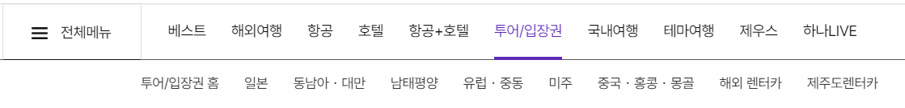
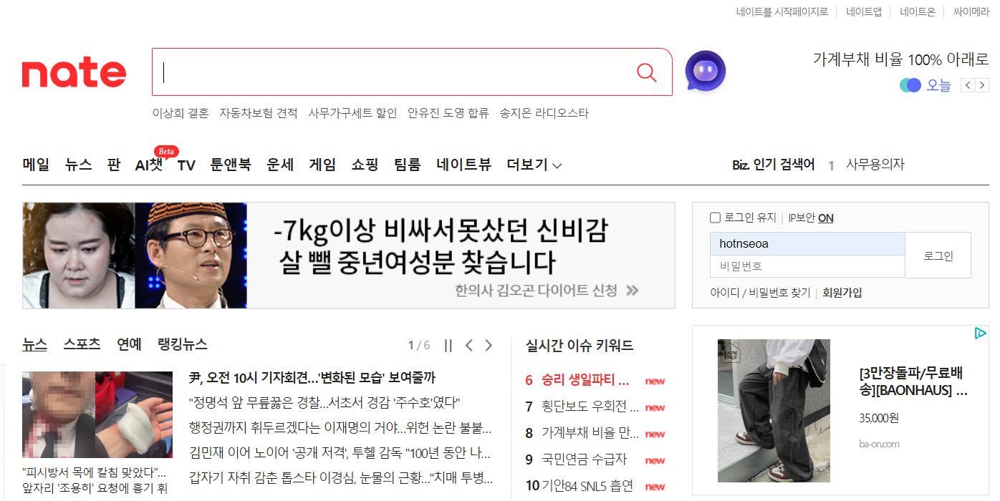
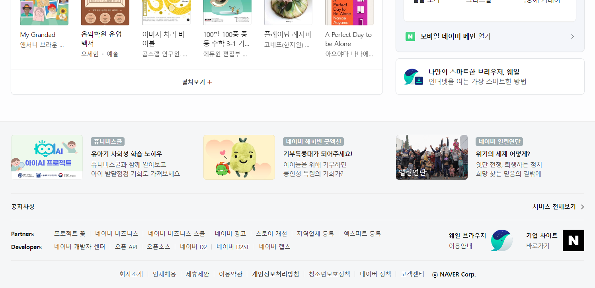
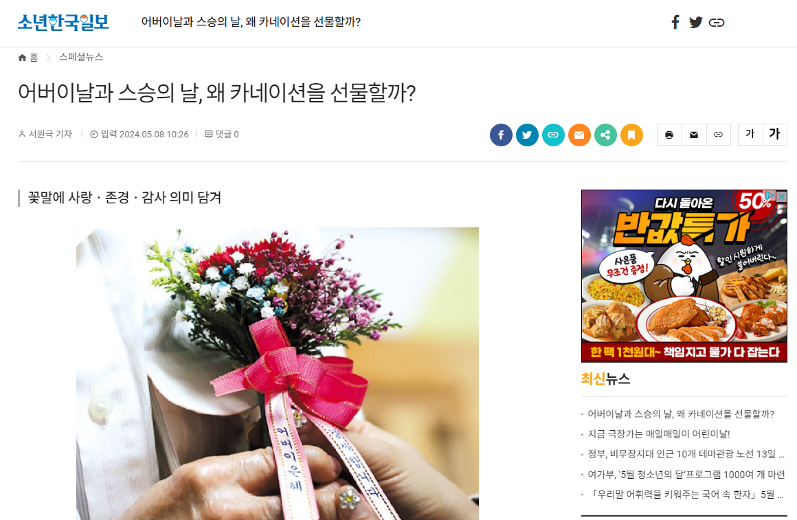
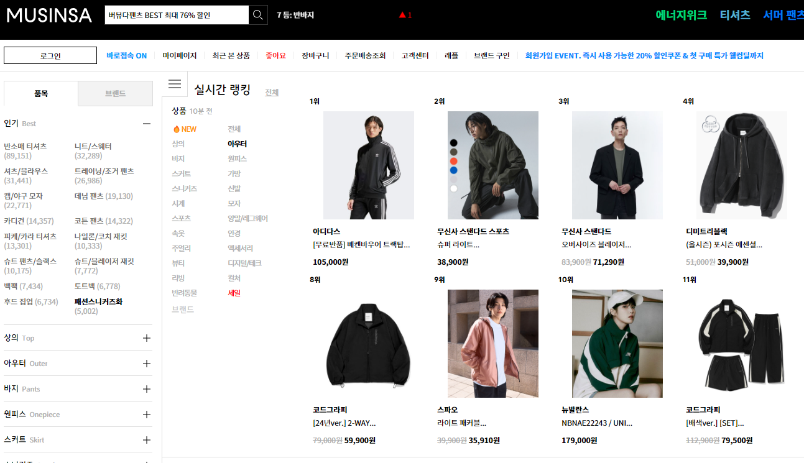
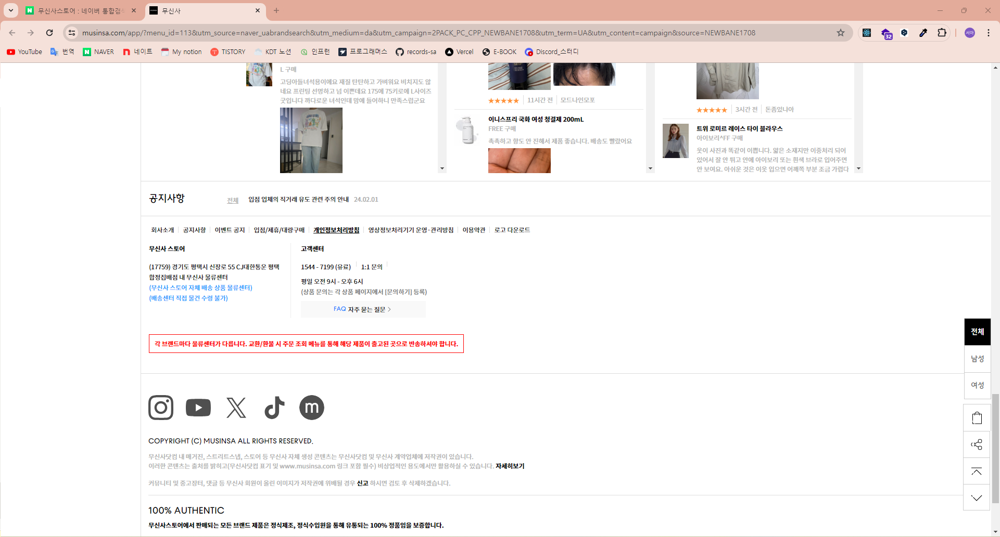

# 내비게이션 기획

# 내비게이션이란?

- 내비게이션(navigation) = 항해
- 사이트를 기획하는 웹 기획자 입장에서의 내비게이션으로, 하나의 사이트 안에서 사이트 내에 있는 페이지와 페이지간의 이동방식
- 사이트 안에서 자유자재로 돌아다닐 수 있는 모든 방법을 내비게이션이라고 하며, 이는 사이트 이용의 가장 기본적인 흐름이 됨

# 내비게이션 기획이란?

- 이용자가 사이트에 들어와서 자신이 원하는 곳을 찾아가거나, 사이트 목적에 부합되는 행동을 할 수 있도록 사이트 내의 자유로운 이동을 돕는 방법들을 제공하는 것
- 메뉴의 구성과 그에 대한 구조가 근본적으로 부합되어 이루어져야 하며, 메뉴의 구조를 기획하는 부분부터 내비게이션 기획에 포함하기도 함
- 메뉴 구성 자체도 내비게이션의 중요한 한 방법이지만, 메뉴의 경우 콘텐츠에 대한 의미가 더욱 크므로 콘텐츠 기획 부분에서 기획해야 함
- 상업용 사이트의 경우 가장 좋은 내비게이션은
    - 모든 사용자에게 가장 친근한 방식으로 쉽게 콘텐츠를 찾을 수 있게 하는 것
    - 항상 자신이 사이트 전체 구도 중 어느 부분에 와 있는지 알게 하는 것
    - 자신이 원하는 곳으로 최소의 클릭으로 이동할 수 있도록 하는 것
- 내비게이션 자체가 이용자에게 너무나 친숙하고 익숙한 부분으로 잘 배치되어 있어 이용자들이 내비게이션 기획이 되어 있다는 것을 전혀 인식하지 않고 불편을 못 느끼는 사이트가 된다면 최고의 내비게이션 기획이라고 할 수 있음

# 내비게이션의 종류

## 1. 메인 메뉴

- 사이트의 전체 구성을 가장 쉽게 볼 수 있고, 이용자들이 가장 먼저 사이트를 파악하는 것이 바로 메뉴
- 메인 메뉴는 전체 콘텐츠의 구성적 논리성과 처음 이용하는 사람이 사이트를 쉽게 파악하고 자신이 원하는 정보로 이동 가능한지를 판단하는 접근성의 기본이 되므로 매우 중요한 내비게이션
- 가장 기본이 되는 내비게이션이므로 이용자들이 편하게 이용할 수 있도록 다른 사이트와 같이 상단에 위치하는 것이 좋음
- 될 수 있으면 쉽게 파악할 수 있도록 크고 가독성이 좋게 표현해야 함

## 2. 서브 메뉴

- 메뉴의 깊이(depth)
    - 대부분의 웹 사이트는 한 사이트 내에서도 다양한 콘텐츠를 제공하기 때문에 메인 메뉴만으로 정의할 수 없는 경우가 많음
    - 이런 경우 각 메인 메뉴당 하위 메뉴를 사용하고, 그 하위 메뉴에 또 다시 아래 단계의 메뉴를 추가함
    - 메뉴의 깊이가 깊어질수록 이용자들은 자신이 원하는 서비스를 찾기 위해 여러 단계의 이동을 해야 하며, 보고 있는 콘텐츠에서 다른 콘텐츠로 이동할 때 시간이 많이 걸리게 됨
    - 따라서 가능하면 깊지 않은 하위 메뉴 단계, 그리고 많지 않고 집중적인 메인 메뉴의 구성이 바람직함

### 서브 메뉴를 표현하는 방식

- 메인 메뉴에 마우스 커서를 올렸을 때 그 바로 아래에 해당하는 하위 메뉴가 보이도록 하는 방법
    
    
    
    - 각 메뉴에 들어가보지 않고 메인 메뉴에 커서를 올리는 것만으로 하위 메뉴까지 한번에 확인이 가능하므로 전체 사이트를 둘러보는 기능이 우수함
    - 하위 메뉴를 원클릭으로 선택할 수 있으므로 자주 이용하는 이용자들의 경우 자신이 원하는 서비스로 접근하는데 클릭 단계를 줄일 수 있음
    - 어떤 세부 페이지를 보고 있는 중에도 다른 상단 메뉴의 아래 단계 메뉴까지 한번에 접근할 수 있음
    - 단점이라면 마우스를 다른 곳으로 옮기면 하위 메뉴가 사라져버리고, 하위 메뉴를 선택할 때 상단 메뉴에 마우스를 가져가서 하위 메뉴가 나타나면 마우스를 다른 곳으로 이동하지 않고 하위 메뉴를 따라 원하는 곳으로 가져가야 하기 때문에 마우스 사용이 익숙하지 못한 장년층에게는 불편할 수 있음

- 상단에 주메뉴가 위치하고, 주 메뉴를 선택하면 좌측에 하위 메뉴가 보여지는 형태
    - 메뉴의 깊이가 3단계인 경우 사용하는 일반적인 메뉴 구성 형태
    - 앞에서 언급한 상단 롤오버 형태의 내비게이션의 단점을 보완하기 위해 좌측 서브 메뉴와 병행해서 사용하는 경우도 있음

## 3. 검색창 형태의 내비게이션

- 정보를 제공하는 사이트나 뉴스를 제공하는 사이트들에 많이 적용되는 내비게이션으로, 많은 정보를 메뉴를 통해 찾기가 힘든 경우에 매우 유용한 기능
- 페이지의 정보들이 데이터베이스에 담겨 있거나, 인덱스(index) 서버를 사용해야 하는 단점이 있음
- 기본적으로 메뉴를 통한 내비게이션이 있는 상태에서 보조 기능으로 사용되는 것이 좋음
- 네이버, 구글 같은 검색엔진에서는 카테고리 링크와 함께 가장 중요한 내비게이션 형태로 사용되기도 함

## 4. 모든 페이지에 들어가는 회사 소개형 내비게이션

- 주로 회사 소개, 사이트맵, 개인정보 보호정책, 광고 안내 등을 표시할 때 많이 사용함
- 사이트의 주제와는 벗어나지만, 사이트를 이용하는 데 꼭 필요한 메뉴들로 전체 메뉴의 통일성과 집중력을 높이기 위해 주메뉴에서 빠져나오는 경우가 많은 메뉴들을 페이지의 가장 상단이나 하단에 위치하며, 모든 페이지에 일괄적으로 들어가는 것이 특징

- 모든 페이지의 하단에서 링크를 보여주는 방법
    
    
    
    - 검색엔진에서 특정 사이트를 찾았을 때 너무 많은 관련 사이트 정보가 나오는 단점을 보완
    - 꼭 보여주어야 하는 중요한 메뉴들이지만, 주메뉴에 넣기에는 분량도 많고 전체적인 메뉴 통일성을 잃어버릴 수 있는 형태의 메뉴들을 모아 사용

- 모든 페이지의 상단에 표시하는 방법
    
    
    
    - 이런 형태의 내비게이션은 모든 페이지에 들어가기는 하지만 이용자들의 시선을 잘 끌지 못하기 때문에 사이트 이용의 주제가 되는 중요한 콘텐츠를 넣는 것은 삼가는 것이 좋음
    

## 5. 드롭다운 형태의 내비게이션

- 사이트 좌측에 버튼을 누르면 언제든지 원하는 페이지로 이동할 수 있도록 함
- 이런 형태의 내비게이션도 일반적으로 주메뉴의 보조적 역할을 수행하며, 공간을 많이 절약할 수 있는 내비게이션

## 6. 현재 위치를 표시하는 내비게이션

- 상단에 현재 보여주는 페이지의 메뉴 단계나 카테고리 단계를 표시해주는 내비게이션이 있음
- 이 메뉴는 자신이 보고 있는 페이지를 알려줌으로써 전체적으로 길을 잃지 않고 원활히 사이트를 볼 수 있도록 하며, 메뉴의 단계가 깊은 경우 자신이 원하는 상위 단계로 한번에 이동할 수 있는 편리함이 있음

## 7. 관련된 문서를 보여주는 내비게이션

- 어떤 페이지를 는 도중에 그 페이지와 관련된 문서 또는 메뉴를 보여주고 링크를 걸어줌으로써 횡적인 내비게이션을 이루는 방법
- 주로 기사형의 콘텐츠나 뉴스, 게시판 등에서 사용하는 방법으로 사용자의 편의를 많이 반영함
- 비슷한 방법으로 텍스트로 되어 있는 내용 중에 관련 글이 있는 경우 해당 언어에 직접 링크를 거는 경우가 있음
- 이때는 관련 글뿐 아니라 주석이나 사전적인 내용들이 제공되기도 하며, 주로 신문이나 정보 제공 사이트에서 많이 활용하고 있는 방법

## 8. 언어 및 지역에 관련된 내비게이션

- 다국적 체제로 운영하고 있는 경우 지역에 대한 내비게이션을 제공하여 어떤 나라의 페이지로 들어가도 자신이 원하는 언어 및 국가에 관련된 사이트로 이동할 수 있도록 하는 것
- 타겟 이용자층이 여러 언어를 사용하는 경우, 또는 언어가 다른 2개 이상의 국가를 대상으로 하는 사이트의 경우 언어를 변환할 수 있는 내비게이션을 두고 있음

## 9. 강조하는 정보나 최신 정보를 보여주는 내비게이션

- 대부분 사이트의 메인 페이지에는 사이트 전체에서 강조하고 싶은 부분이나 새로운 정보를 보여주고, 해당 페이지로 직접 이동할 수 있는 내비게이션을 제공

## 다양한 내비게이션의 동시 사용

- 기획자들은 각 기능의 특징과 이점들을 미리 파악하고 있어야 기획하는 사이트의 적시적소에 내비게이션을 사용할 수 있으며, 또한 다양한 내비게이션을 복합적으로 사용하여 이용자들의 다양한 인터넷 이용 취향을 맞출 수 있음
- 한 페이지 안에서도 여러 가지 형태의 내비게이션을 통해 원활하게 사이트를 이용할 수 있도록 하고 있음
- 가장 좋은 내비게이션은 이용자가 내비게이션이 있다는 것을 눈치채지 못하고 아무 부담 없이 사이트를 이용할 수 있도록 하는 것이므로, 적시적소에 내비게이션을 적용하여 사이트를 활성화 해야 함